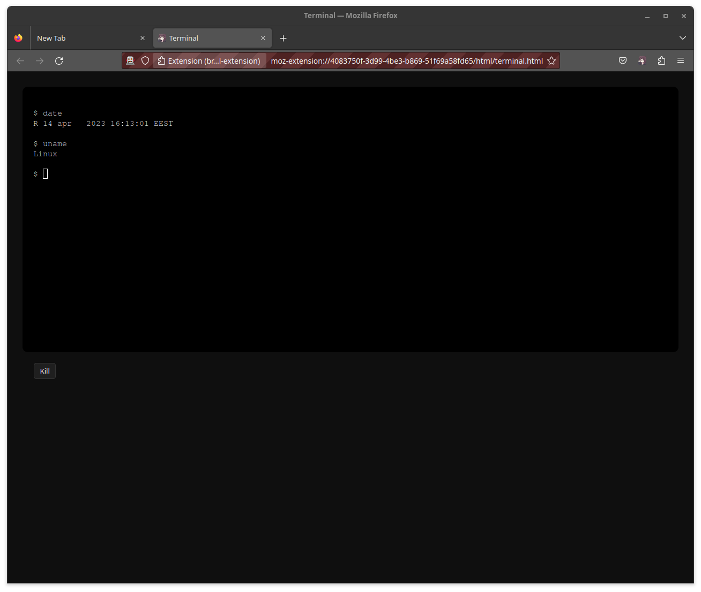

# browser-terminal-extension

Extension that allows you to open a native shell in the browser

Untested on windows

```
git clone https://github.com/ayes-web/browser-terminal-extension
pnpm install
```

## Dependencies
   - python3
   - nodejs + npm/pnpm

## Running with firefox in development mode
```
pnpm start
```

## Installing unpacked extension to firefox

### 1. Install native manifest & build extension
```
pnpm native-manifest install
pnpm build
```

### 2. Install extension to firefox
1. Navigate to ``about:debugging#/runtime/this-firefox``
2. Click ``Load temporary Add-on...``
3. Choose ``dist`` folder in the file picker

## Usage

- Click on the extension icon


